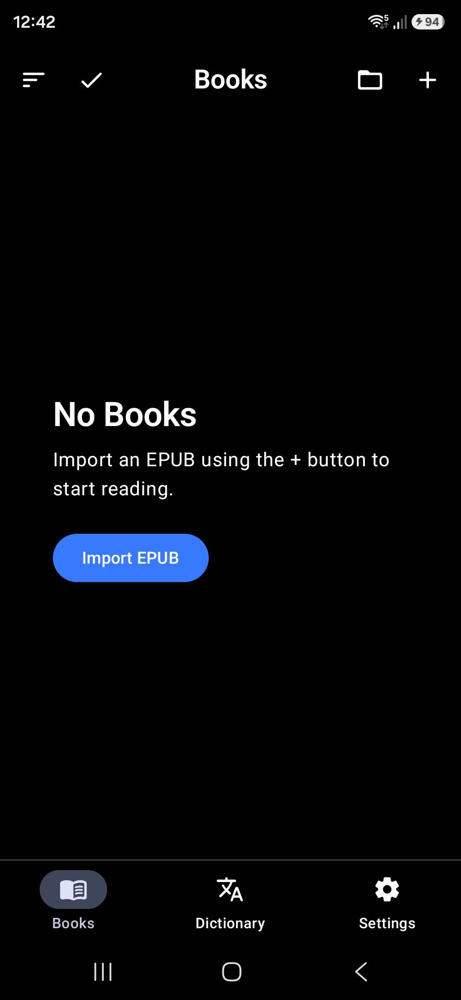
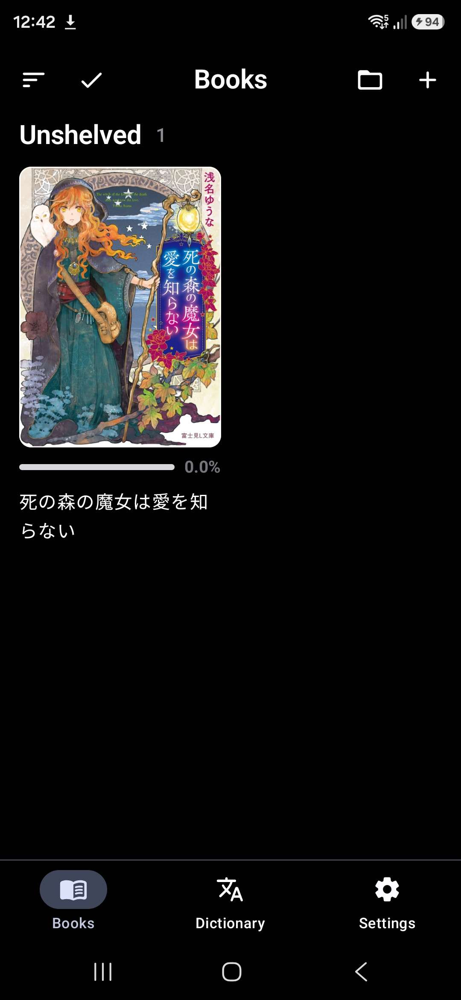
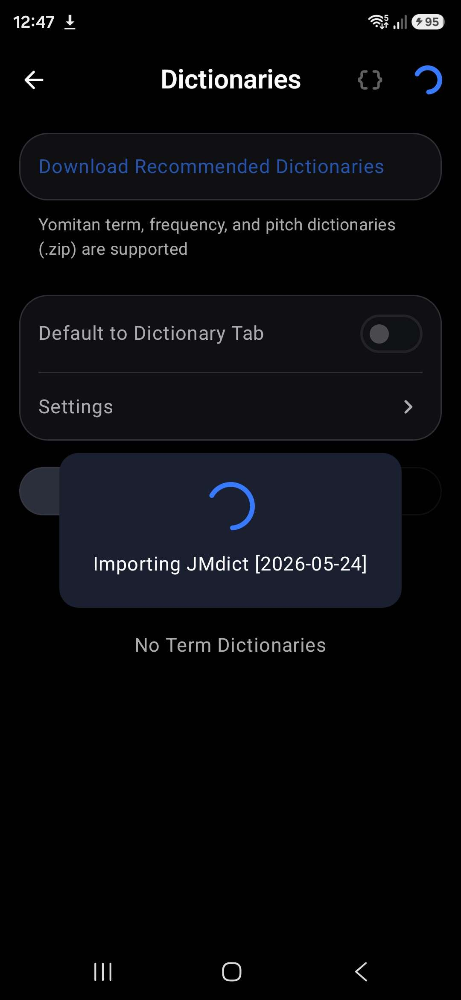
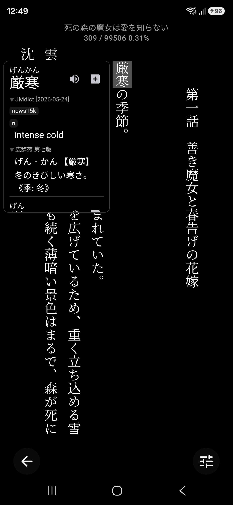
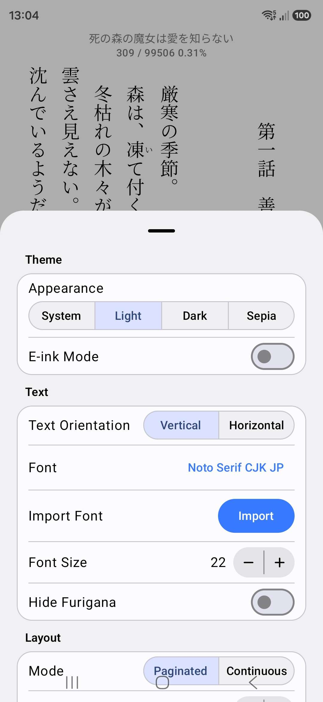
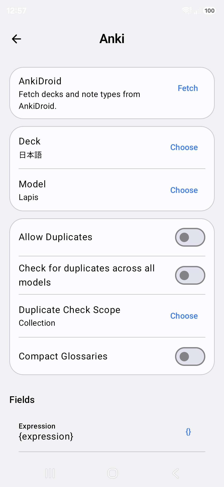
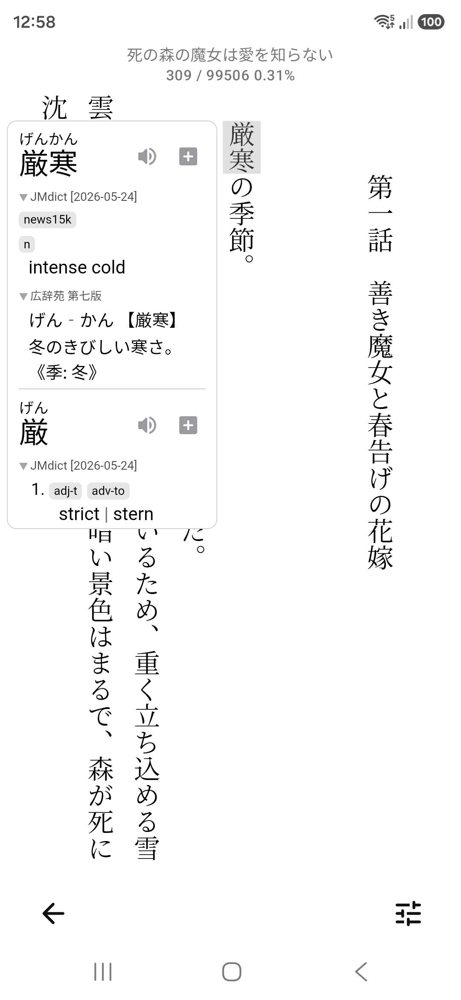
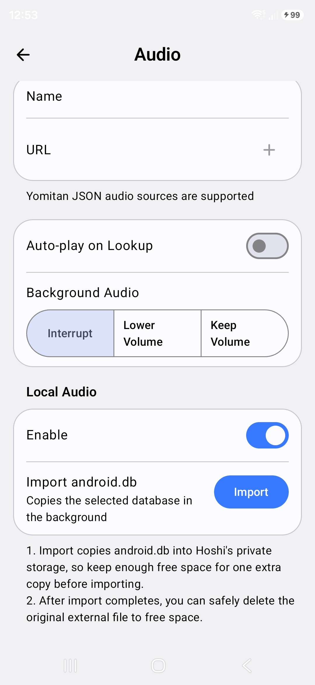

# Mobile Reading Setup

- [(Android) Hoshi Reader](https://github.com/HuangAntimony/Hoshi-Reader-Android)
- [(iOS) Hoshi Reader](https://apps.apple.com/us/app/hoshi-reader/id6758244332)
- [(Android) PopLingo — OCR lookups in any app (manga, visual novels, games)](https://play.google.com/store/apps/details?id=com.aktaris.chattranslator)
- [Manatan - recommended for manga](#manatan-all-in-one-anime-manga-and-novels)

The best app currently for reading on a mobile device is **Hoshi Reader**, which has both iOS and Android versions. The Android version has first-class support for e-ink devices.

## Android

Download Hoshi Reader [here](https://github.com/HuangAntimony/Hoshi-Reader-Android/releases) - it is currently only available as an .apk, so you would need to sideload it.  

1. Download the .apk file, then open your device's file manager and tap on the downloaded .apk.  
2. Allow the permission for the file manager app to install unknown apps if prompted.
3. Tap "Install" once permission is granted.  

{: style="max-height: 800px; width: auto; display: block; margin: 0 auto;" }  

Open the app and you will see the "Import EPUB" button, this is how you'll import a book into Hoshi Reader.

This will open the file picker, select an EPUB file to import your book.  
{: style="max-height: 800px; width: auto; display: block; margin: 0 auto;" }  
By default your books will appear as "Unshelved". The folder icon in the top-right is how you can manage your *Shelves*. This is useful for keeping categorizing your books (plan to read, high priority, low priority, dropped, on hold, completed etc.)  

To set up the pop-up dictionary, go to *Settings* then "Dictionaries". To import from .zip, tap the + in the top-right corner. Hoshi Reader can automatically fetch the latest version of JMdict with the "Download Recommended Dictionaries" option.  
{: style="max-height: 800px; width: auto; display: block; margin: 0 auto;" }  
Start reading by tapping on your imported book in *Books*.  

Tap on a word to trigger the pop-up dictionary.  
{: style="max-height: 800px; width: auto; display: block; margin: 0 auto;" }  
You can adjust the appearance of the reader by tapping the settings button in the bottom-right corner. You can also adjust the size of the dictionary popup in this menu, at the bottom.  
{: style="max-height: 800px; width: auto; display: block; margin: 0 auto;" }  
### Anki setup

This requires [AnkiDroid](https://play.google.com/store/apps/details?id=com.ichi2.anki) to be installed.  

In Hoshi Reader, go to *Settings* → *Anki* → tap *Fetch* in AnkiDroid. Allow the permission when prompted.  

Then, choose the Anki deck.  
{: style="max-height: 800px; width: auto; display: block; margin: 0 auto;" }  
The card type "Model" will automatically be configured for Lapis, which is the recommended card type. The fields will also be automatically configured. For most people, the Anki setup is complete at this point.  

You can then add Anki cards by opening a book, tapping a word to look it up then pressing the **+** button in the dictionary pop-up  

{: style="max-height: 800px; width: auto; display: block; margin: 0 auto;" }  
### Local Audio

Note: the local audio database uses 5.79GB of space on your device. Please ensure your device has sufficient space to not be out of space when the local audio database is imported to your device.

Download: [android.db](https://drive.google.com/file/d/1Fn11_nN04zM89yKFYBWVTi0Xpaf6I3qe/view)  

Setting up local audio is easy. You just need to import the android.db file. 

Set it up: *Settings* → *Advanced* → *Audio* → Local Audio: Enable → tap "Import" and pick the `android.db` file.  
{: style="max-height: 800px; width: auto; display: block; margin: 0 auto;" }  
Hoshi Reader will automatically add the *Local* source and prefer it over the default source(s).  

You are done!  
## iOS
### Hoshi Reader

Hoshi Reader, the best ッツ+Yomitan+mining alternative for iOS is now available on the [App Store](https://apps.apple.com/us/app/hoshi-reader/id6758244332) for devices running iOS 18 or later.  

## Android - PopLingo (OCR lookups in any app)

PopLingo gives you instant **OCR** dictionary lookups in any app (manga, visual novels, games) - using Yomitan dictionaries.

### Setup
1. Install [**PopLingo**](https://play.google.com/store/apps/details?id=com.aktaris.chattranslator) from the Play Store.
2. Complete the quick onboarding (it sets everything up and installs a starter dictionary).

### Using PopLingo
1. Start PopLingo’s overlay (floating tab).
2. Open the app you want to use (manga, visual novel, game, etc.).
3. **Drag the tab over a word** to look it up.

### Add more dictionaries (optional)
1. Open PopLingo → **Add Dictionaries → Import Local Dictionary**.
2. Import your Yomitan-format dictionary ZIP files (the same ones you use on desktop).
3. Wait for the import to finish.

??? info "Tips"
    - **High contrast** (dark text on a light background) improves accuracy.
    - If results look off, **zoom in** a bit and try again.
    - OCR struggles with **blurry images** or **very stylized fonts**.

## Manatan (all-in-one anime, manga, and novels)

Manatan is an all-in-one app for anime, manga, and novels. It supports Desktop, iOS, and Android.

### Setup
1. Download and install the latest **native Android** release (`.apk`) from [Manatan Releases](https://github.com/KolbyML/Manatan/releases).
2. Launch Manatan.

### Using Manatan
1. Open **Browse** on the sidebar, then go to the **Extensions** tab.
2. (If needed) add extension repos. You can add Mihon, Aniyomi, and Aidoku extension repos (for example: `https://raw.githubusercontent.com/keiyoushi/extensions/repo/index.min.json`).
3. Tap **Install** on the source extensions you want.
4. Open **Sources**, pick a title, then start reading or watching.
