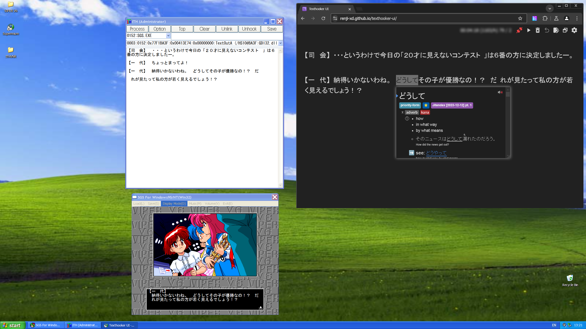

# Running Old Visual Novels on Windows XP
Occasionally, you'll find VNs that either have compatibility issues, or won't work at all in modern versions of Windows or Wine. This is where a Windows XP VM comes in handy.

!!! failure This guide only covers Windows XP. If you're installing XP through a hypervisor (e.g VirtualBox, QEMU & VMWare), please refer to your hypervisor's documentation.

!!! tip If you already have XP installed: Insert a Windows XP Installation CD, press ++windows+r++, type`intl.cpl`, then press ++enter++. Follow Step 2, then restart. 

## Requirements
	
Hypervisor (e.g. QEMU, VirtualBox) & AMD-V/VT-x enabled, or hardware capable of running XP

Windows XP ISO & Product Key - Google is your friend, SP3 Professional VL ISOs are highly recommended.

## Setup

!!! tip At least 512MB is recommended for a basic XP SP3 install, 1-2 GB for Yomitan & web browsing. More than 2GB is unnecessary for XP, and any other 32-bit OS. **Disable networking in your Virtualization software unless you plan to update XP and go online.**

1. You will be greeted with a blue installation screen. Follow the instructions until you're asked to format your drive. Choose NTFS ("Quick" format, if it's available) & wait until your system reboots.
2. During the graphical phase of installation, you'll see `Regional and Language Options`. When this window appears, click `Customize`. In the window that pops up, click on the `Languages` tab on the top left and check `Install files for East Asian Languages`. Click `OK` and click on the `Regional Options` tab. Set `Standards and Formats` to `Japanese`, and `Location` to `Japan`.  Lastly, click on the `Advanced` tab and change `Language for non-Unicode Programs` to `Japanese`. Click `OK`, and wait for the files to install. 

Some VNs check your format, location, and time zone as a method of region-locking. A non-Japanese locale breaks text in VNs, showing garbage instead. 

3. Enter your Name, Company (can be anything), and Product Key.
4. Change your `Time Zone` to `(GMT +9:00) Osaka, Sapporo, Tokyo`.

	4.1. If you set up networking, you'll be asked to configure it. Customize these settings as necessary, then click `Next` twice & wait until your system reboots.
5. Before the OOBE (Out-of-Box Experience) starts, you'll see a window. Click `OK`, then `Next` to apply the resolution change. 
6. In the OOBE: Click `Next`, `Not right now`, `Next`.

	6.1. If the OOBE detects your Network, you'll be asked about how your network is configured and whether you want to activate Windows (on a retail copy of XP). Select `Yes, this computer will connect through a local area network or home network` and `No, remind me every few days` (for retail copies of XP), as online activation is broken. Click `Next`. Fill in `Your Name` (the Administrator account) and other users' names as necessary, click `Next`, then `Finish`.

6. Wait until the welcome screen shows. Nostalgic, isn't it?
7. (Optional) To get rid of the annoying "Your PC may be at risk" balloon, click on the red X shield on your Taskbar, then click `Recommendations...` under `Virus Protection`. Check `I have an antivirus program that I'll monitor myself` and click OK.
Congratulations, you now have a VN-ready XP install!
## Additional Software
[MacType](https://github.com/snowie2000/mactype/releases/download/2019.1-beta6/MacTypeInstaller_2019.1-beta6.exe) - Fix pixelated CJK font. Use registry mode. :slight_smile:  

[xp_activate32](https://archive.org/download/xp_activate32_202305/xp_activate32.zip) - Activates retail copies of XP

[Supermium](https://www.win32subsystem.live/supermium/) - Modern Chromium on Windows XP

[MyPal](https://github.com/Feodor2/Mypal68/releases/latest) - Modern browser based off Firefox 68, less resource intensive than Supermium & recommended for PCs <1GB RAM

## Using ITHVNR for text hooking
[ITHVNR](https://drive.proton.me/urls/C2QY84DYX0#vRIWAHdwnAb0) is an XP-supported alternative of Texthooker. Install 
[Legacy Update](https://legacyupdate.net/) first to update your root certificates 
(Enable POSReady 2009 updates if you'd like),
then [Visual C++ Redistributable 2013](https://aka.ms/highdpimfc2013x86enu). Extract the RAR file using [7-Zip](https://www.7-zip.org/). Updating your system through Legacy Update is *highly* recommended.

From now on, you may either use shared clipboards (if your virtualization software *supports* it) and use your host OS for Yomitan reading practice, or do it inside the VM. If you decide the former, the guide ends here. However, if your Virtualization software doesn't support Clipboard Sharing (or you're on real hardware), follow the steps below:
  
1. For Supermium users, install [Yomitan](https://chromewebstore.google.com/detail/yomitan/likgccmbimhjbgkjambclfkhldnlhbnn). For MyPal users, you'll need to install the ol' [Yomichan](https://github.com/FooSoft/yomichan/releases/download/22.10.23.0/yomichan-firefox.xpi), since Yomitan doesn't work on Firefox 68. 

**Note: Importing Jitendex *will* cause memory-related crashes.** Install [these custom split dictionary files](https://drive.proton.me/urls/NSC3JVDV64#lfoRs2KHcQxW) as a workaround.

2. Go to the [Texthooker UI Webpage](https://renji-xd.github.io/texthooker-ui/), click the gear icon & check `Enable Paste`.

# Here's what both methods look like, in action

<h3>Found this useful? Consider supporting me on Patreon!</h3>   

[:fontawesome-brands-patreon: Support me on Patreon](https://www.patreon.com/shoui){: .md-button }

