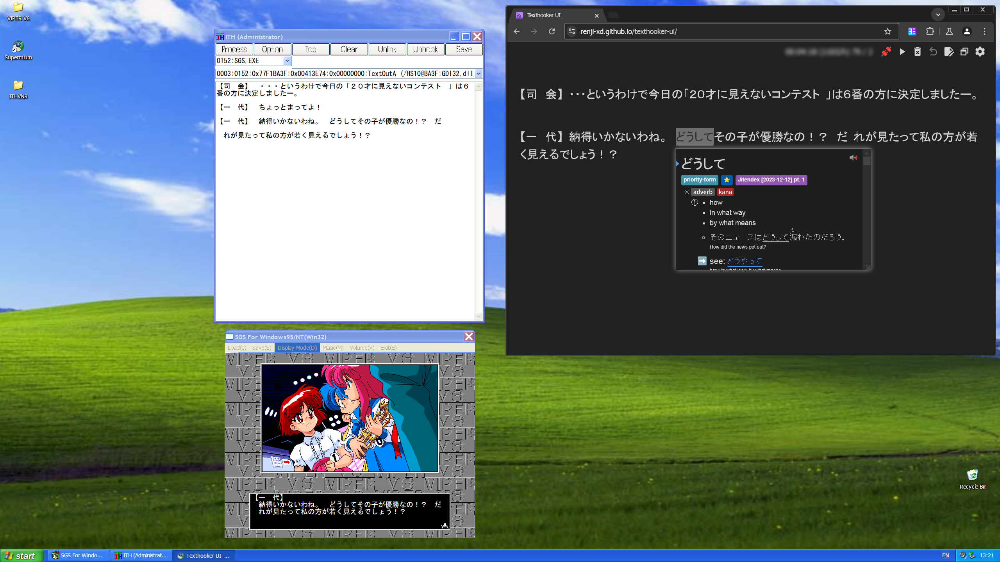

# Running Old Visual Novels on Windows XP/Server 2003 (XP x64)
Occasionally, you'll find VNs that either have compatibility issues, or won't work at all in modern versions of Windows or Wine. This is where a Windows XP VM comes in handy.

!!! failure "This guide only covers Windows XP/Server 2003 (XP x64)." 
	If you're installing XP through virtualization (e.g VirtualBox, QEMU & VMWare), please refer to your hypervisor's documentation. Additionally, if you're installing XP on a machine with an SSD, XP supports neither Drive Alignment nor TRIM, which will shorten the lifespan of your drive. This does *not* affect virtualization.

??? abstract "If you already have XP installed:" 
	1. Insert a Windows XP Installation CD.
	2. Press ++windows+r++
	3. Type`intl.cpl`, then press ++enter++
	4. Follow steps 2 - 4, then restart. 

## Requirements
	
Hypervisor (e.g. QEMU, VirtualBox) & AMD-V/VT-x enabled, or hardware capable of running XP

Windows XP ISO & Product Key - Google is your friend.

## Setup

??? tip "At least 512MB is recommended for a basic Service Pack 3 install, 1-2 GB for Yomitan & web browsing." 
	More than 2GB is unnecessary for XP, and any other 32-bit OS, since no program will be able to use more than 2 GB. **If you connect your machine to the Internet, [updating](https://legacyupdate.net/) is strongly recommended.**
	Some VNs also check your formats, location, and time zone as a method of region-locking. A non-Japanese locale breaks text in VNs, showing garbage instead. 

1. You will be greeted with a blue installation screen. Follow the instructions until you're asked to format your drive. Choose NTFS ("Quick" format, if it's available) & wait until your system reboots.
2. During the graphical phase of installation, you'll see `Regional and Language Options`. When this window appears, click `Customize`.
3. In the window that pops up, click on the `Languages` tab on the top left and check `Install files for East Asian Languages`. Click `OK`, then click on the `Regional Options` tab. Set `Location` to `Japan`.
4. Switch to the `Advanced` tab, and change `Language for non-Unicode Programs` to `Japanese`. Click `OK`, and wait for the files to install.
5. Click "Customize" again, and set `Standards and Formats` to `Japanese`. Click OK.click on the `Regional Options` tab. Set `Standards and Formats` to `Japanese`, and `Location` to `Japan`.  Lastly, 
6. Enter your Name, and Product Key.
7. Change your `Time Zone` to `(GMT +9:00) Osaka, Sapporo, Tokyo`, then click `Next`.
8. If you set up networking (and your XP disc has the drivers for said hardware), you'll be asked to configure it. Unless you know what you're doing, click `Next` twice & wait until your system reboots.
9. Before the OOBE (Out-of-Box Experience) starts, you'll see a window. Click `OK`, then `Next` to apply the resolution change. 
10. In the OOBE: Click `Next` twice.
11. If XP's setup detects a network connection: Select `Yes, this computer will connect through a local area network or home network`, then `No, remind me every few days` (if your copy of XP requires activation). Click `Next`.
12. Fill in `Your Name`, click `Next`, then `Finish`. Wait until the welcome screen shows. Nostalgic, isn't it?
14. (Optional) To get rid of the annoying "Your PC may be at risk" balloon, click on the red X shield on your Taskbar, then click `Recommendations...` under `Virus Protection`. Check `I have an antivirus program that I'll monitor myself` and click OK.
Congratulations, you now have a VN-ready XP install!
## Additional Software
[MacType](https://github.com/snowie2000/mactype/releases/download/2019.1-beta6/MacTypeInstaller_2019.1-beta6.exe) - Fix pixelated CJK font. Use registry mode. :slight_smile:  

[xp_activate32](https://archive.org/download/xp_activate32_202305/xp_activate32.zip) - Activates XP, if required
 
[Supermium](https://www.win32subsystem.live/supermium/) - Modern Chromium on Windows XP

[MyPal](https://github.com/Feodor2/Mypal68/releases/latest) - Modern browser based off Firefox 68, less resource intensive than Supermium & recommended for PCs <1GB RAM

## Using ITHVNR for text hooking
!!! info "If you installed Legacy Update, your root certificates are up-to-date."
[ITHVNR](https://drive.proton.me/urls/C2QY84DYX0#vRIWAHdwnAb0) is an XP-supported alternative of Texthooker. [Update your root certificates first](https://github.com/JohnTHaller/RootCertificateUpdatesForLegacyWindows/releases/latest),
then install [Visual C++ Redistributable 2013](https://aka.ms/highdpimfc2013x86enu). Extract the RAR file using [7-Zip](https://www.7-zip.org/).

From now on, you may either use shared clipboards (if your virtualization software *supports* it) and use your host OS for Yomitan reading practice, or do it inside the VM. If you decide the former, the guide ends here. However, if your Virtualization software doesn't support Clipboard Sharing (or you're on real hardware), follow the steps below:
  
1. For Supermium users, install [Yomitan](https://chromewebstore.google.com/detail/yomitan/likgccmbimhjbgkjambclfkhldnlhbnn). For MyPal users, you'll need to install [Yomichan](https://github.com/FooSoft/yomichan/releases/download/22.10.23.0/yomichan-firefox.xpi), since Yomitan doesn't work.
2. Go to the [Texthooker UI Webpage](https://renji-xd.github.io/texthooker-ui/), click the gear icon & check `Enable Paste`.

!!! failure "**Importing Jitendex *will* cause memory-related crashes.**" 
	Install [a split version](https://drive.proton.me/urls/NSC3JVDV64#lfoRs2KHcQxW) as a workaround.

# Here's what both methods look like, in action

from VM

from PC

example of everything in VM

<h3>Found this useful? Consider supporting me on Patreon!</h3>   

[:fontawesome-brands-patreon: Support me on Patreon](https://www.patreon.com/shoui){: .md-button }

